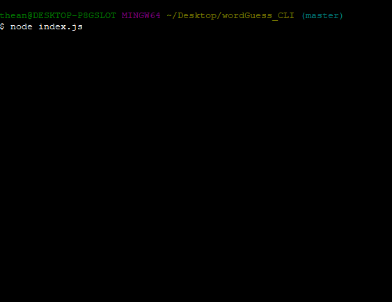
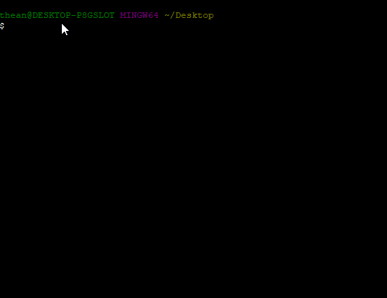
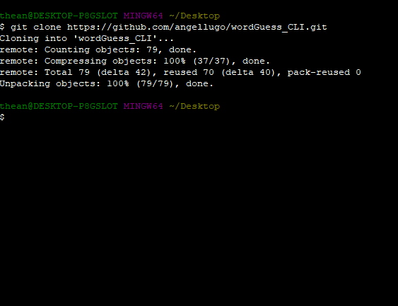
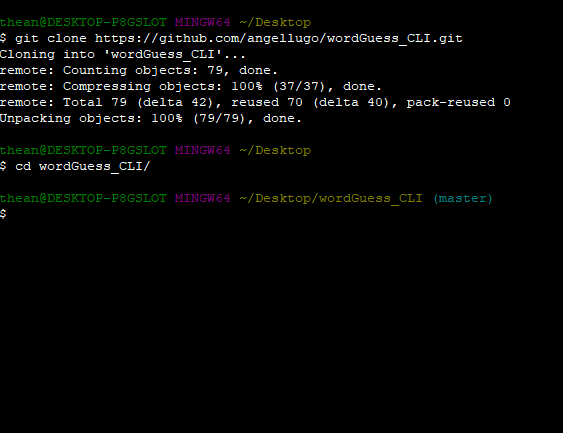
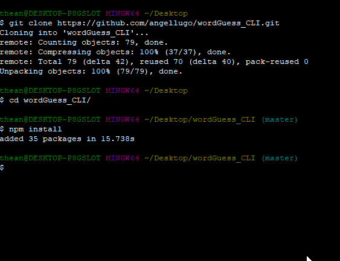

# wordGuess_CLI
A Command-Line-Interface word game played by guessing letters until you guess the random word picked by the game.

## Prerequisites

You must have the following installed:

1.  bash

2. git

3. node.js

## How to install

1. Clone this repository using git. Type the following line in bash.

    `git clone https://github.com/angellugo/wordGuess_CLI.git`

    This is an example of how to clone it:

    

2. Go inside the wordGuess_CLI folder using the following in bash.
    `cd wordGuess_CLI`

    This is an example:

    

3. Install the necessary Node Package Modules (NPMs) by typing the following in bash:

    `npm install`

    This is how:

    

## How to run the game
1. Run the game using node with typing the following in bash:

    `node index.js`

    
